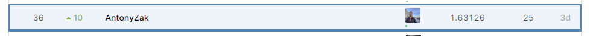

# MADE_CV_Contest_2
Repository for kaggle competition "Car plates OCR" for the computer vision course of the MADE Mail.ru Group project

**Public and private score screen:**

**Place in LB score screen:**

**My main steps**
* What I tried to do, but failed: 
  * Data augmentation for the detector (blur, black squares, random crop).
  * Data augmentation (issued by teachers, 60 thousand license car plates) for the recognizer (vertical flip, perspective, artificial spots).
  * Tried to use fasterrcnn_resnet50 as the model for the detection.
  * “Frozen” all layers at the pretrained detector.
  * Taught more than 2 epochs detector.
  * Taught more than 3-4 epochs recognizer.
  * Increased image size for the recognizer.
  * Tried using LSTM instead of GRU in the recognizer.
* What worked for me:
  * Tried using the pretrained maskrcnn_resnet50 as the main model for the detector (this gave an increase score from 0.80 to 0.57 in public LB).
  * Сhose a more complicated convolutional network for the recognizer, such as resnext50_32x4d, resnext101_32x8d (I chose resnext101_32x8d at last submission).
  * Increased the hidden size of GRU layer from 128 to 1024.
  * Set parameter "bidirectional=True" in GRU layer (RNN part of recognizer).
  * Set optimizer and scheduler type and parameters for detector and recognizer.
